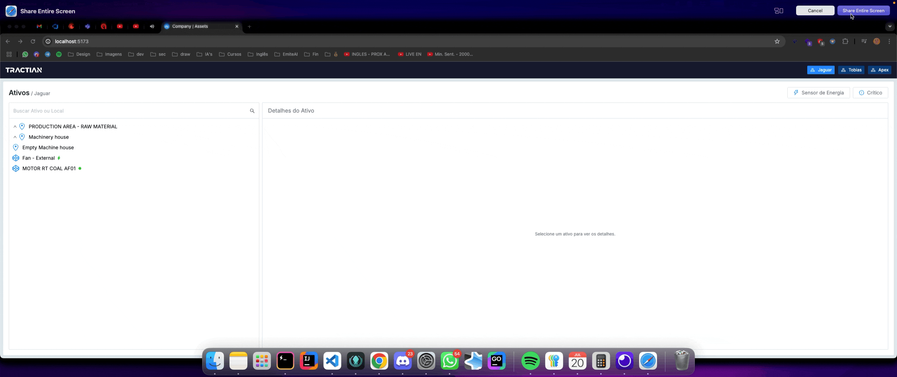

# Tree Assets Company Viewer

## Demo:



[Página de demonstração](https://tree-assets.netlify.app)

## Pontos que eu melhoria/faria se tivesse mais tempo:

- Salvar os filtros de uma forma que ao atualizar a página eles sejam mantidos, como salvar no localStorage ou utilizando a URL;
- Criar mais testes unitários, incluíndo teste de integração e renderização;
- Ajustar a responsividade para a aplicação ter uma boa UX em diversos tamanhos de tela;
- Melhorar a captura e exibição de possíveis erros;
- Utilizar virtualização de listas na árvore, para evitar travamento na UI e perca de perfomance quando há muitos itens renderizados;
- No filtro de empresas alterar o componente, adicionando um select ao invés de uma lista de botões, para melhorar a visualização caso tenha diversas empresas;
- Criar uma camada de cache no front-end utilizando por exemplo o TanStack Query.

## Getting Started

To run the project locally, follow these steps:

```bash
# Clone the repository
git clone https://github.com/rharison/tree_view_companies_assets

# Navigate to the project directory
cd tree_view_companies_assets

# Install dependencies
npm install

# Start the development server
npm run dev
```
